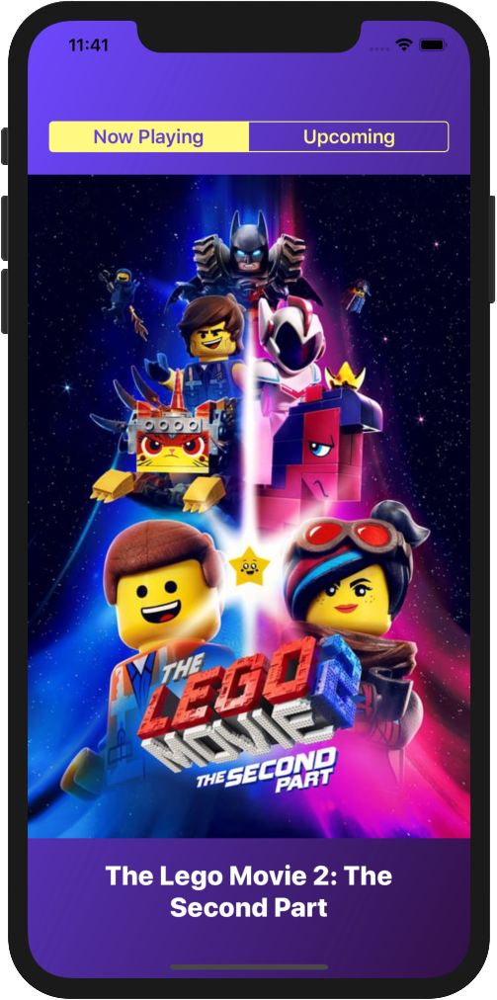

# Hello!
*Thanks for stopping by*. This repo serves as a kind of ever-changing portfolio of projects I'm currently excited about; please feel free to look around.

# DarkRoom
DarkRoom is a take-home project I recently completed as part of the interview process for an iOS Developer role. The basic requirements for the app were that it display ten currently showing movies and ten upcoming movies, using data from [themoviedb.org](https://www.themoviedb.org/)'s REST api. Choice of design and UI elements were left open to the developer.

I'm quite happy with the final product—it was built entirely in Swift, no external dependencies were used, the UI is attractive, animates smoothly, and is easy to navigate, and perhaps most importantly, the code is clean and easy to read.

&nbsp;&nbsp;&nbsp;&nbsp;&nbsp;&nbsp;&nbsp;&nbsp;&nbsp;&nbsp;&nbsp;&nbsp;&nbsp;&nbsp;&nbsp;&nbsp;&nbsp;&nbsp;&nbsp;&nbsp;

# Dalilah
**Dalilah**—a smart personal assistant for musicians—is my first commercial iOS app. Dalilah makes you a better musician by helping you practice smarter, not harder. The app is written entirely in Swift, and contains no external dependencies.

You can read more about Dalilah by visiting the [official page](https://cmillerco.com/dalilah) on my website. If you're feeling really adventurous, you're welcome to join the beta test while you're there!

&nbsp;&nbsp;&nbsp;&nbsp;&nbsp;&nbsp;&nbsp;&nbsp;&nbsp;&nbsp;&nbsp;&nbsp;&nbsp;&nbsp;&nbsp;&nbsp;&nbsp;&nbsp;&nbsp;&nbsp;

# Longboard
If you'd like to see what else I've been working on, I recommend taking a look at [**Swift CoreRestore**](https://github.com/cmilr/swift-core-restore)—a library I've recently created for adding easy Core Data **backup and restore** functionality to iOS apps. CoreRestore is a work-in-progress, but I'm proud of its simple API, light-weight nature, and the fact that it solves a problem many Swift developers experience.

You might also be interested in [**Swift DateKit**](https://github.com/cmilr/swift-datekit), my library for easily mocking dates and times in Xcode unit and UI tests. Don't be fooled by its small size—**DateKit** is a compact, highly effective set of methods and classes for testing date-critical iOS apps.

Ok, ***I know you're busy***, so thanks again for stopping by—I appreciate your time and interest. 

## Contact Info:

- Email: cary.a.miller@gmail.com
- Website: [cmillerco.com](https://cmillerco.com)
- LinkedIn: [carymiller](https://www.linkedin.com/in/carymiller/)
- Twitter: [@carycodes](https://twitter.com/carycodes)
