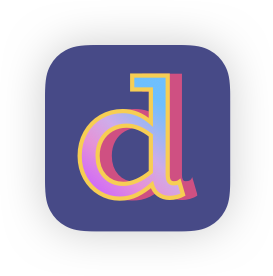
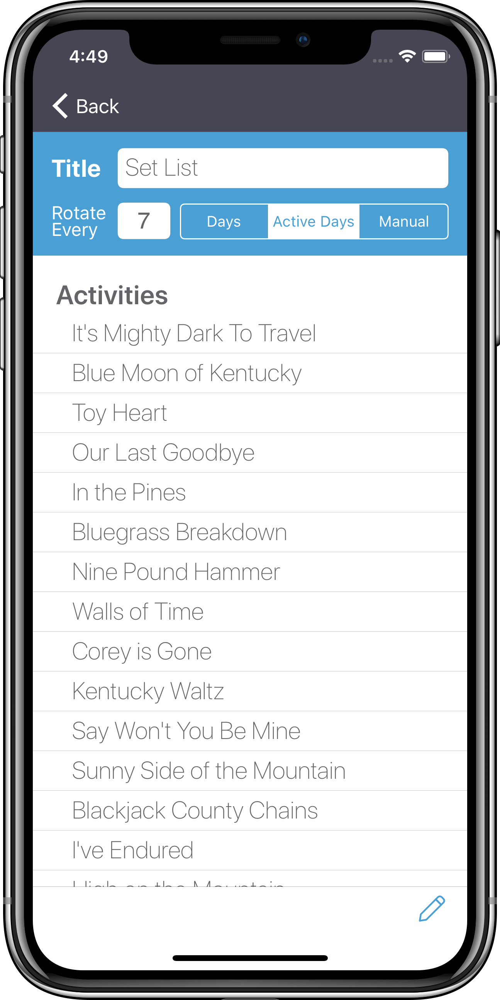

# Dalilah-Public

***Hello, and thanks for stopping by!*** This repo contains the majority of source code for my iOS app **Dalilah**—a smart personal assistant for musicians, students, and other life-long learners.

Due to Dalilah's commercial nature—and nearness to release—I've chosen to make the working repo private, but hopefully I've left enough here to adequately illustrate my coding style and abilities. *So please—feel free to poke around the repo* (and don't miss the screenshots at the bottom of this README.) To learn more about **Dalilah**, you can visit the [official page](https://cmillerco.com/dalilah) on my website.

If your interest is piqued and you'd like to see more of my code, I recommend taking a look at [**Swift CoreRestore**](https://github.com/cmilr/swift-core-restore)—a library I've recently created for adding easy Core Data **backup and restore** functionality to iOS apps. CoreRestore is a work-in-progress, but I'm proud of its simple API, light-weight nature, and the fact that it solves a problem many Swift developers experience.

You might also be interested in [**Swift DateKit**](https://github.com/cmilr/swift-datekit), my library for easily mocking dates and times in Xcode unit and UI tests. It's a compact, highly effective set of methods and classes for testing date-critical iOS apps.

Ok, ***I know you're busy***, so thanks for taking the time to stop by—it's greatly appreciated. 

## Contact Info:

- Email: cary.a.miller@gmail.com
- LinkedIn: [carymiller](https://www.linkedin.com/in/carymiller/)
- Twitter: [@carycodes](https://twitter.com/carycodes)

&nbsp;&nbsp;&nbsp;&nbsp;&nbsp;&nbsp;&nbsp;&nbsp;&nbsp;&nbsp;
