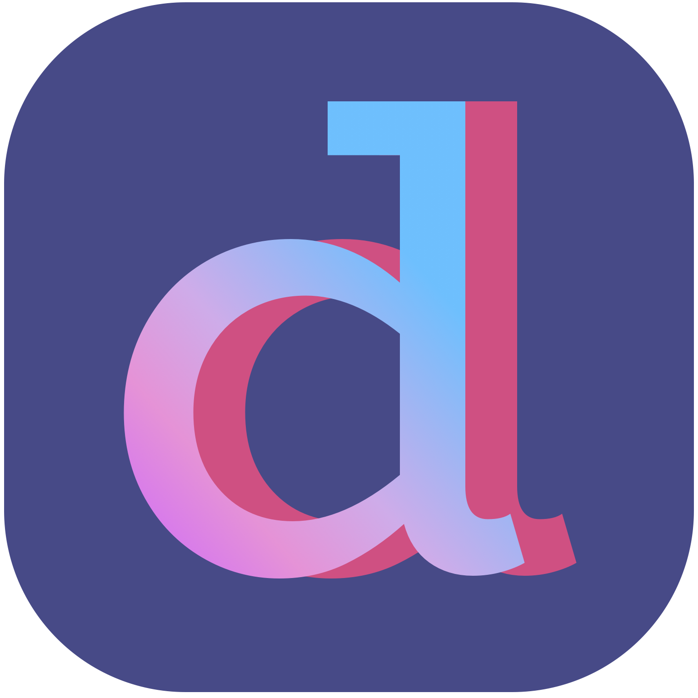

## Dalilah | © 2018 Cary Miller. All rights reserved.

***Hello!*** If you've found your way here there's a good chance you're a prospective employer, so let me start by saying ***thanks for stopping by***. Please, feel free to poke around. 

This repo contains the vast majority of source code for my iOS app **Dalilah**—a smart personal assistant for musicians, students, and other life-long learners. Due to its commercial nature—and nearness to release—I've chosen to make the working repo private from here on out, but hopefully I've left enough here to fully illustrate my coding style and abilities. Should you need greater access though, please feel free to ask; perhaps we can work something out.

If you'd like to learn more about **Dalilah**, you can visit the [official page](https://cmillerco.com/dalilah) on my website.

If you'd like to see more of my code, I recommend taking a look at [**Swift CoreRestore**](https://github.com/cmilr/swift-core-restore)—a library I've recently created for adding easy Core Data backup and restore functionality to iOS apps. CoreRestore is still a work-in-progress, but I'm proud of its simple API, its light-weight nature, and the fact that it solves a problem many Swift developers experience.

Anyway, read more about 

Thanks again for stopping by.

## Contact

- Email: cary.a.miller@gmail.com
- LinkedIn: [carymiller](https://www.linkedin.com/in/carymiller/)
- Twitter: [@carycodes](https://twitter.com/carycodes)
- GitHub: [cmilr](https://github.com/cmilr/)

&nbsp;&nbsp;&nbsp;&nbsp;&nbsp;&nbsp;&nbsp;&nbsp;&nbsp;&nbsp;
